<div align="center">


# 影 (Kage)


</div>

---

# About Me

<div align="center">



```text
━━━━━━━━━━━━━━━━━━━━━━━━━━━━━━━━━━━━━━━━━━━━━━

Name          :: Pouya Omidi

Education     :: B.Sc. Computer Engineering

University    :: Bu-Ali Sina University

Current Focus :: Artificial Intelligence

Interests     :: Computer Vision
                 ML
                 Backend Systems

━━━━━━━━━━━━━━━━━━━━━━━━━━━━━━━━━━━━━━━━━━━━━━
```

</div>

---

# Tech Stack

<div align="center">


</div>

---

# Connect

<div align="center">

[](https://linkedin.com/in/pouya-omidi)

[](mailto:Pouya.omidi05@gmail.com)

</div>

---

<div align="center">

### 静

*"The moon never competes with the sun.*

*It simply shines when its time comes."*

<br>


</div>